<div align="center">


<a href="https://github.com/mbiloldev">
  
</a>

<br/><br/>

[](https://youtube.com/@it_mentor_uz)
[](https://instagram.com/it_mentor_uz)
[](https://t.me/it_mentor_uz)
[](https://x.com/it_mentor_uz)
[](https://github.com/mbiloldev)

</div>

<div align="center">
  
</div>

---

<div align="center">

## 👨‍💻 Men haqimda

</div>

```javascript
const developer = {
  name:     "IT Mentor UZ",
  username: "@it_mentor_uz",
  github:   "mbiloldev",

  skills: {
    frontend:     ["HTML", "CSS", "JavaScript", "React"],
    backend:      ["Node.js", "Python", "REST API", "Database"],
    telegramBots: ["aiogram", "python-telegram-bot", "Webhooks"],
    tools:        ["Git", "GitHub", "VS Code", "Postman"]
  },

  featuredProjects: [
    "🃏 UNO Multiplayer Bot — aiogram 3.x bilan qurilgan Telegram o'yini",
    "🪙 Coin Tap App — Notcoin uslubidagi tap-to-earn"
  ],
  goal:           "Har kuni kod yozib, har kuni o'sib borish 📈",
  available:      true  // Loyihalar uchun tayyor!
};
```

---

<div align="center">

## 🎯 Ko'nikmalar darajasi

</div>

```
Frontend     ████████████████████  100% ✅
Backend      ████████████████████  100% ✅
Telegram Bot ████████████████████  100% ✅
Git & GitHub ██████████████████░░   90% 🔥
UI/UX Design ████████████████░░░░   80% 💎
```

---

<div align="center">

## 🛠️ Texnologiyalar

### 🎨 Frontend


### ⚙️ Backend


### 🤖 Telegram Bot


### 🔧 Tools


</div>

---

<div align="center">

## 🃏 Asosiy Loyiha — UNO Multiplayer Bot

</div>

<div align="center">


> **Telegram guruhlarida to'liq multiplayer UNO o'yini** — Sticker kartalar, stack qoidalari, Wild kartalar va real-time o'yin mantiqi bilan!

</div>

<br/>

### ⚙️ O'rnatish (Setup)

**1. Talablar**


**2. Kutubxonalarni o'rnatish**

```bash
pip install -r requirements.txt
```

**3. Muhit o'zgaruvchilarini sozlash**

`.env.example` faylini nusxa olib `.env` nomini bering va to'ldiring:

```bash
cp .env.example .env
```

`.env` ichida:

```env
BOT_TOKEN=123456789:ABCdefGhIjKlmNoPQRsTUVwxYz
BOT_USERNAME=your_bot_username
```

**4. Sticker ID larini qo'shish**

`stickers.py` faylidagi `STICKERS` lug'atiga barcha kartalar uchun Telegram sticker `file_id` larini qo'ying.

> 💡 **Maslahat:** Sticker `file_id` ni olish uchun botga stickerini yuboring va `@RawDataBot` yordamida `file_id` ni aniqlang.

**5. Botni ishga tushirish**

```bash
python bot.py
```

---

### 📁 Fayl tuzilmasi

```
uno_bot/
├── 🤖 bot.py              # Kirish nuqtasi, dispatcher
├── ⚙️  config.py           # BOT_TOKEN, konstantlar
├── 🎨 stickers.py         # STICKERS lug'ati (file_id lar)
├── 🃏 deck.py             # Card klassi, Deck klassi
├── 🎮 game.py             # GameState klassi, barcha o'yin mantiqi
├── ⌨️  keyboards.py        # Barcha inline keyboard qurilmalari
├── 📂 handlers/
│   ├── lobby.py           # /newgame, qo'shilish, boshlash
│   ├── gameplay.py        # karta o'ynash, karta olish, rang tanlash
│   └── misc.py            # /quit, /cards, /status
├── 📋 requirements.txt
└── 🔐 .env.example
```

---

### 🃏 O'yin qoidalari

| Karta | Ta'sir |
|:---:|:---|
| 🔢 0–9 | Oddiy raqamli kartalar |
| 🚫 Skip | Keyingi o'yinchi navbatini o'tkazib yuboradi |
| 🔄 Reverse | Navbat yo'nalishini o'zgartiradi |
| ➕ +2 | Keyingi o'yinchi 2 karta oladi va navbatini yo'qotadi (stack mumkin) |
| 🌈 Wild | Har qanday kartaga qo'yiladi, rang tanlanadi |
| 🌈 Wild +4 | Har qanday kartaga qo'yiladi, keyingi +4 karta oladi (stack mumkin) |
| 🌈 Wild +10 | Har qanday kartaga qo'yiladi, keyingi +10 karta oladi (stack mumkin) |

#### 📚 Stack qoidalari

```
+2  →  +2   ✅  (bir xil rang kerak)
+4  →  +2   ✅  (stack qilinadi)
+10 →  +2   ✅  (stack qilinadi)
+2  →  +4   ❌  (mumkin emas)
+2  →  +10  ❌  (mumkin emas)
```

---

### 💬 Buyruqlar

| Buyruq | Ta'rif |
|:---:|:---|
| `/newgame` | 🎮 Yangi o'yin yaratish (guruhda) |
| `/quit` | 🚪 O'yindan chiqish |
| `/cards` | 🃏 Kartalaringizni qayta ko'rish |
| `/status` | 📊 O'yin holatini ko'rish |

---

### ⚙️ BotFather sozlamalari

BotFather da quyidagi sozlamalarni o'rnating:

**Commands:**
```
newgame - Yangi UNO o'yini boshlash
quit - O'yindan chiqish
cards - Kartalarimni ko'rish
status - O'yin holati
```

> ⚠️ **Muhim:** Bot guruhda xabarlarga javob berish huquqiga ega bo'lishi kerak. Guruhga botni qo'shganda **admin** qiling yoki xabar yuborish ruxsatini bering.

---

<div align="center">

## 🪙 Qo'shimcha Loyiha — Coin Tap App

</div>

<div align="center">

> **Notcoin-ga o'xshash tap-to-earn web ilova** — To'liq Frontend bilan qurilgan, silliq animatsiyalar va real-time coin tizimi bilan!

</div>

| 🔧 Xususiyat | 📝 Tavsif |
|:---:|:---|
| 🎮 Tap Mexanikasi | Bosgan sayin coin ko'payadi |
| ✨ Animatsiyalar | Har bosishda vizual effektlar |
| 📱 Responsive | Telefon va kompyuterda mukammal |
| ⚡ Tez ishlaydi | Optimallashtirilgan kod |
| 🎨 Chiroyli UI | Professional dizayn |

---

<div align="center">

## 📊 GitHub Statistika


<br/>


</div>

---

<div align="center">

## 📈 Faollik Grafigi


</div>

---

<div align="center">

## 🐍 Contribution Snake

<picture>
  <source media="(prefers-color-scheme: dark)" srcset="https://raw.githubusercontent.com/mbiloldev/mbiloldev/output/github-contribution-grid-snake-dark.svg">
  <source media="(prefers-color-scheme: light)" srcset="https://raw.githubusercontent.com/mbiloldev/mbiloldev/output/github-contribution-grid-snake.svg">
  
</picture>

</div>

---

<div align="center">

### 💬 Bog'laning!


[](https://t.me/it_mentor_uz)


</div>
